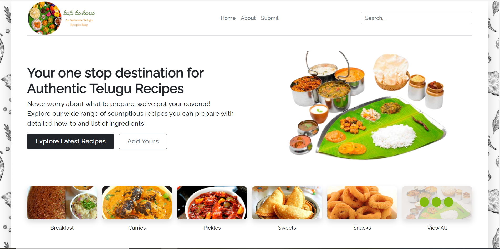

<!-- PROJECT LOGO -->
<br />
<div align="center">
  <a href="https://github.com/github_username/repo_name">
    
  </a>

<h3 align="center">Mana Ruchulu</h3>

  <p align="center">
    An authentic telugu recipes blog.
    <br />
    <a href="https://manaruchulu.herokuapp.com/">View Demo</a>
  </p>
</div>

<!-- ABOUT THE PROJECT -->
## About The Project


<p align="right">(<a href="#top">back to top</a>)</p>

### Built With

* 
* 
* 
* 
<p align="right">(<a href="#top">back to top</a>)</p>


<!-- GETTING STARTED -->
## Getting Started

To get a local copy up and running follow these simple steps.

### Prerequisites
* npm
  ```sh
  npm install npm@latest -g
  ```
* MongoDB Cluster
  ```sh
  mongodb+srv://<YOUR_MONGODB_USERNAME>:<YOUR_MONGODB_PASSWORD>@cluster0.pnc8j.mongodb.net/<DATABASE_NAME>?retryWrites=true&w=majority
  ```

### Installation

1. Clone the repo
   ```sh
   git clone https://github.com/sarvaniballamudi/recipe-webapp.git
   ```
2. Install NPM packages
   ```sh
   npm install
   ```
3. Create a .env file with the following values
  * MONGODB_URI = MongoDB Cluster from prerequisites.
  * SECRET = <any long string>

<p align="right">(<a href="#top">back to top</a>)</p>


<!-- USAGE EXAMPLES -->
## Usage

* For development environment
    ```sh
    npm run dev
    ``` 
    
* For production environment
    ```sh
    npm run start
    ``` 

<p align="right">(<a href="#top">back to top</a>)</p>

<!-- CONTACT -->
## Contact

Sarvani Ballamudi - (https://linkedin.com/in/sarvaniballamudi)

Project Link: [https://github.com/sarvaniballamudi/recipe-webapp](https://github.com/sarvaniballamudi/recipe-webapp)

<p align="right">(<a href="#top">back to top</a>)</p>
